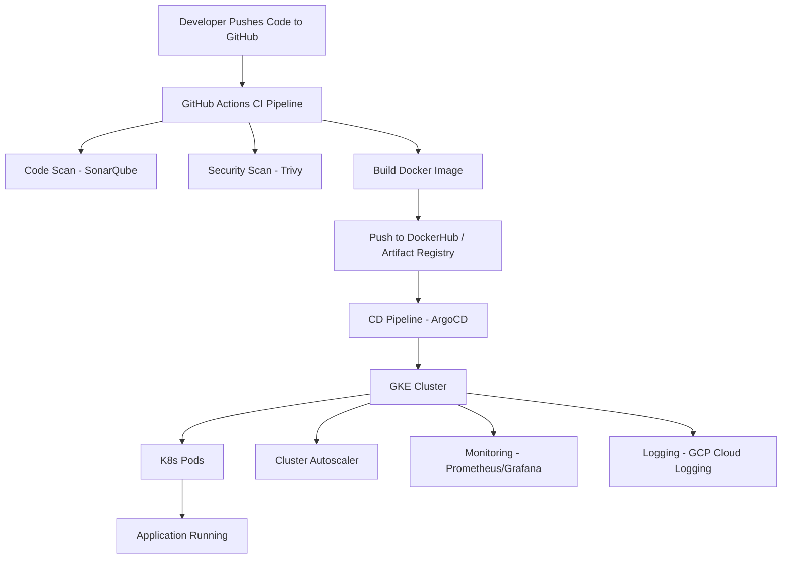

# CI Pipeline with DevSecOps (Trunk‑Based Development)

This document explains a complete CI/CD pipeline using **DevSecOps practices**, designed for **GCP, GKE, Google Artifact Registry, ArgoCD, GitHub Actions, and GitOps**.

---

# ✅ 1. Overview

We follow **Trunk‑Based Development**:

* Developers create short‑lived feature branches.
* PR Validation Pipeline blocks bad code.
* After merging into `main`, code flows to **Development**, then **Pre‑Prod**, and finally **Production**.
* All environments follow **GitOps** via ArgoCD.

---

# ✅ 2. Pipeline Stages

## 🟦 Stage 1: PR Validation Pipeline (Before Merge)

Purpose: **Stop bad code from reaching main**.

Steps:

1. Checkout code
2. Install dependencies
3. Lint check
4. Unit test cases
5. CodeQL security scan (SAST)

✅ Only when all checks pass, PR is allowed to merge.

---

## 🟩 Stage 2: Development Pipeline (After Merge to main)

Purpose: Build → Scan → Upload → Prepare for Pre‑Prod.

Steps:

6. Upload artifact to GCS (timestamp + Git SHA)
7. Docker build
8. Trivy image scan
9. Push to Google Artifact Registry
10. Update K8s manifests with Git SHA
    
CD - ArgoCD auto‑sync deploys to **Development namespace**

---

## 🟧 Stage 3: Pre‑Prod Pipeline

Purpose: Build → Scan → Deploy → Dynamic Application Security Testing.

Steps:

6. Upload artifact to GCS
7. Docker build
8. Trivy scan
9. Push to Artifact Registry
10. Deploy to Pre‑Prod via ArgoCD sync
11. OWASP ZAP DAST Scan on Pre‑Prod URL
12. Update manifests with Git SHA
    
CD - ArgoCD auto‑sync deploys to **Pre-Prod namespace**

✅ Pre‑Prod always runs a tested, scanned version.

---

## 🟥 Stage 4: Production Pipeline (Release Tag)

Triggered by:

* `release/x.y.z` branch OR
* GitHub Release Tag `v1.0.0`

Steps:

6. Upload artifact to GCS (timestamp + Release Tag)
7. Docker build
8. Trivy scan
9. Push image to Artifact Registry (tagged)
10. Update manifests with **Release Tag**
    
CD - ArgoCD sync deploys to Production namespace in Production GKE cluster (Release Tag) Triggered by:

✅ Production runs only on tagged, stable builds.

---

# ✅ 3. Benefits

* Strong DevSecOps integration
* End‑to‑end scanning (SAST, SCA, DAST)
* GitOps for automated deployments
* Secure and auditable pipeline
* Traceable builds with SHA + timestamps
* Predictable rollout using release tags

---

# ✅ 4. GitOps (Easy Explanation)

**GitOps = Git is the source of truth + ArgoCD deploys automatically.**

### Why GitOps?

* No direct access to cluster
* Full audit history
* Easy rollback by reverting Git commit
* Safe, automated deployments

### How GitOps Works in This Pipeline

* GitHub Actions updates Helm/K8s manifests
* ArgoCD watches the GitOps repo
* It auto‑deploys to Dev → Pre‑Prod → Prod

---

# ✅ 5. CI/CD Flow Diagram (ASCII)

```
Developer → Pull Request → PR Pipeline
     │        │
     │        ├── Lint
     │        ├── Unit Tests
     │        ├── CodeQL Scan
     │        └── ✅ Merge Allowed
     │
     ▼
Merge to main → Development Pipeline
     ├── Build → Scan
     ├── Artifact to GCS
     ├── Push to Artifact Registry
     └── ArgoCD Deploy → Dev
     ▼
Pre‑Prod Pipeline
     ├── Build + Trivy
     ├── Push Image
     ├── Deploy to Pre‑Prod via ArgoCD
     └── OWASP ZAP DAST
     ▼
Create Release Tag → Production Pipeline
     ├── Build + Scan
     ├── Push Release Image
     ├── Update Manifests
     └── ArgoCD Deploy → Prod
```

---

# ✅ 6. DevSecOps Architecture Diagram (ASCII)

```
                ┌──────────────────────────┐
                │        Developers         │
                └───────────────┬──────────┘
                                │
                                ▼
                ┌──────────────────────────┐
                │    GitHub Repository     │
                └────────────────┬─────────┘
                                │
                                ▼
             ┌───────────────────────────────┐
             │     Stage 1: PR Validation    │
             │ Lint | Unit Tests | CodeQL    │
             └─────────────────┬─────────────┘
                               │
                               ▼
             ┌───────────────────────────────┐
             │   Stage 2: Development        │
             │ Build → Scan → Deploy via GitOps│
             └─────────────────┬─────────────┘
                               │
                               ▼
             ┌───────────────────────────────┐
             │   Stage 3: Pre‑Prod Pipeline  │
             │  Build → Scan → Deploy → DAST │
             └─────────────────┬─────────────┘
                               │
                               ▼
                ┌──────────────────────────┐
                │ Google Artifact Registry │
                └─────────────┬────────────┘
                              │
                              ▼
                  ┌──────────────────────┐
                  │   GKE Cluster (Dev) │
                  └──────────────────────┘
                              │
                              ▼
                  ┌──────────────────────┐
                  │ GKE Cluster (Pre)   │
                  └──────────────────────┘
                              │
                              ▼
                  ┌──────────────────────┐
                  │ GKE Cluster (Prod)  │
                  └──────────────────────┘
```

---

# ✅ 7. CI/CD + DevSecOps + GKE Architecture (Mermaid)



---

# ✅ 8. Complete Summary

This CI/CD pipeline ensures:

* Strong DevSecOps
* Fast, secure releases
* Full GitOps automation
* Production‑ready quality
* GKE + Artifact Registry + ArgoCD best practices

If you want, I can add:

* rollback strategy
* branching strategy diagram
* YAML examples
* Helm folder structure
