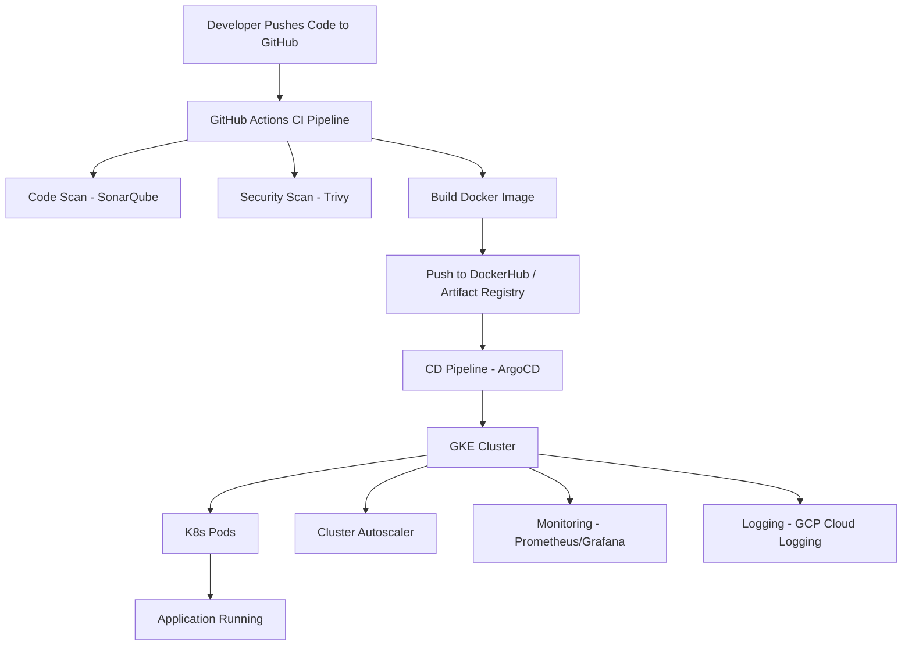

# CI Pipeline with DevSecOps (Trunk‑Based Development)

This document explains a complete CI/CD pipeline using **DevSecOps practices**, designed for GCP, GKE, Google Artifact Registry, and GitHub Actions.

---

# ✅ 1. Overview

We follow **Trunk‑Based Development** where:

* Developers create short‑lived feature branches.
* A strict PR validation pipeline must pass before merging into `main`.
* After merge, the application is deployed to **pre‑prod**.
* After successful testing, a **release tag** triggers the production deployment.

This ensures security, quality, and fast releases.

---

# ✅ 2. CI/CD Pipeline Stages

## 🟦 Stage 1: PR Validation Pipeline (Before Merge)

Purpose: **Block bad code before reaching main.**

Steps:

1. **Checkout Code** – Pull repository code.
2. **Install Dependencies** – Install required packages/libraries.
3. **Lint Check** – Validate code formatting and syntax.
4. **Unit Tests** – Validate logic and functionality.
5. **CodeQL Scan (SAST)** – Perform static code security analysis.

✅ The PR can merge **only if all checks pass**.

---

## 🟧 Stage 2: Pre‑Prod Pipeline (After Merge to main)

Purpose: **Build → Scan → Deploy → Security test on Pre‑Prod.**

Steps:

6. **Upload Artifact to GCS** (timestamp + Git SHA) – Versioned build tracking.
7. **Docker Build** – Build application container.
8. **Trivy Vulnerability Scan** – Scan image for CVEs.
9. **Push to Google Artifact Registry** – Store the built image.
10. **Deploy to Pre‑Prod Namespace in GKE** – Update Kubernetes deployment.
11. **OWASP ZAP DAST Scan** – Test live pre‑prod URL for vulnerabilities.
12. **Update K8s Manifests with Git SHA** – Version‑specific deployments.

✅ Pre‑prod always runs a tested and scanned version.

---

## 🟩 Stage 3: Production Pipeline (Triggered by Release Tag)

Purpose: **Deploy stable, tagged versions to production.**

Triggered by:

* `release/x.y.z` branch, or
* GitHub Release Tag `v1.0.0`

Steps:

6. **Upload Artifact to GCS** (timestamp + Release Tag)
7. **Docker Build** – Rebuild image for consistency.
8. **Trivy Scan** – Ensure no vulnerabilities.
9. **Push to Artifact Registry (Release Tag)** – Stable, traceable version.
10. **Update Production K8s Manifests with Release Tag** – Ensures predictable rollouts.
11. **Deploy to Production Namespace** – Final deployment.

✅ Production runs only on tagged, tested, and scanned builds.

---

# ✅ 3. Key Benefits

* Strong **DevSecOps**: CodeQL, Trivy, DAST integrated.
* Secure image management via Artifact Registry.
* Clear separation of **PR → Pre‑Prod → Production**.
* Auditable builds through GCS artifact storage.
* Git SHA and release tag–based versioning.

---

# ✅ 4. Summary

This pipeline ensures:

* High code quality
* Strong security checks
* Reliable deployments
* Traceable versions
* Fast delivery using Trunk‑Based Development

This is a production‑grade CI/CD workflow suitable for modern microservices deployed on GKE.

---

# ✅ 5. CI/CD Flowchart (Simple ASCII Diagram)

```
 Developer → Pull Request → PR Pipeline
     │               │
     │               ├── Lint Check
     │               ├── Unit Tests
     │               ├── CodeQL Scan
     │               └── ✅ Merge Allowed
     │
     ▼
 Merge to main → Pre-Prod Pipeline
     │
     ├── Build Artifact → Upload to GCS
     ├── Docker Build → Trivy Scan
     ├── Push to Artifact Registry
     ├── Deploy to Pre-Prod (GKE)
     └── OWASP ZAP DAST Scan
     │
     ▼
 Create Release Tag → Production Pipeline
     │
     ├── Build + Scan
     ├── Push Release Image
     ├── Update Prod Manifests
     └── Deploy to Prod Namespace
```

# ✅ 6. DevSecOps Architecture Diagram (ASCII)

```
                ┌──────────────────────────┐
                │        Developers         │
                └───────────────┬──────────┘
                                │
                                ▼
                ┌──────────────────────────┐
                │    GitHub Repository     │
                └────────────────┬─────────┘
                                │
                                ▼
             ┌───────────────────────────────┐
             │     Stage 1: PR Validation    │
             │ Lint | Unit Tests | CodeQL    │
             └─────────────────┬─────────────┘
                               │
                               ▼
             ┌───────────────────────────────┐
             │   Stage 2: Pre-Prod Pipeline  │
             │  Build → Scan → Deploy → DAST │
             └─────────────────┬─────────────┘
                               │
                               ▼
                ┌──────────────────────────┐
                │ Google Artifact Registry │
                └─────────────┬────────────┘
                              │
                              ▼
                  ┌──────────────────────┐
                  │   GKE Cluster (Pre)  │
                  └──────────────────────┘
                              │
                              ▼
             ┌───────────────────────────────┐
             │   Stage 3: Production Deploy   │
             │    Using Release Tags         │
             └─────────────────┬──────────────┘
                               │
                               ▼
                  ┌──────────────────────┐
                  │ GKE Cluster (Prod)   │
                  └──────────────────────┘
```

If you want, I can add diagrams, flowcharts, or YAML examples into this file.

## 🏗️ CI/CD + DevSecOps + GKE Production Architecture Diagram


